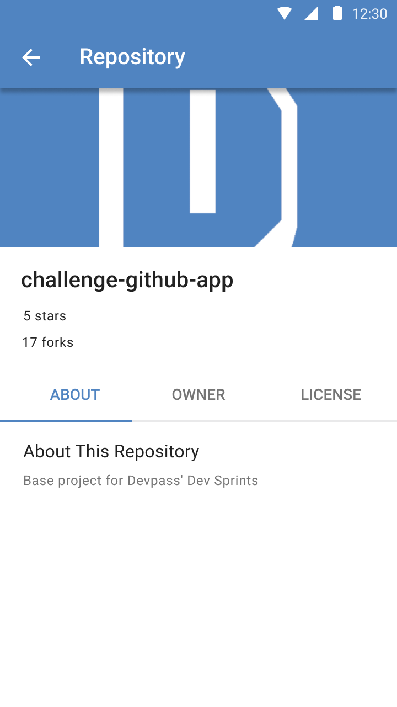
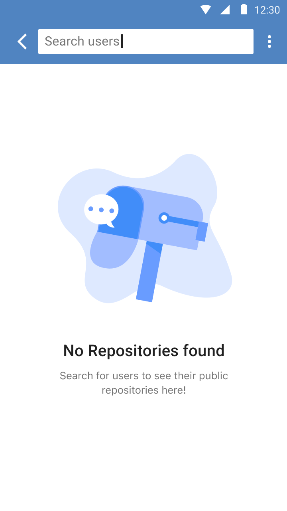
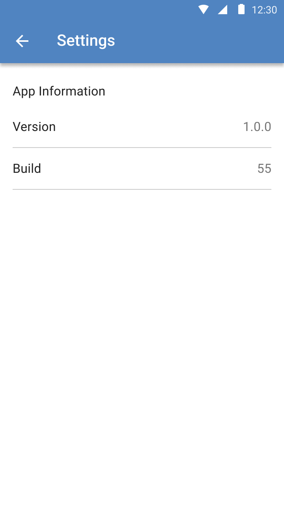

# GitHub App Challenge 🐙

In this challenge, we will develop an Android application that shows repositories of a GitHub user.

# Contributing

1. Fork and clone this repository.
2. Start a new feature branch. 
3. Open `solutions` folder and access your Dev Sprint's project.
4. Build, run and code! 👩‍💻

# About Devpass

Devpass is a diverse community of high-potential software developers accelerating their careers through real-world product development and mentorship from tech leaders of the best tech companies.

Interested? Access www.devpass.com.br for more information!